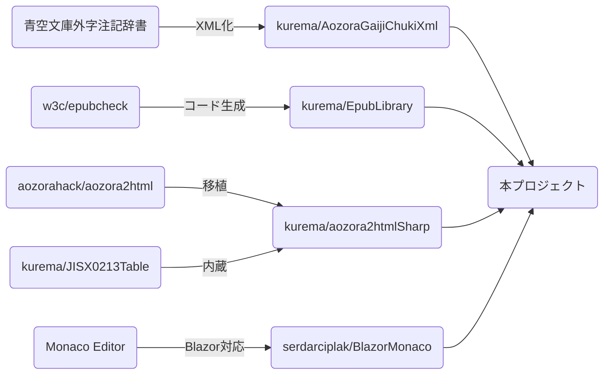

# AozoraEditorBlazorWasm
青空文庫ファイルエディタ (開発中)

## スクリーンショット

## 関連プロジェクト
Powered by
* .NET
* Blazor Wasm
* Monaco Editor

| プロジェクト | 派生元 | 説明 | 
| -- | -- | -- |
| [kurema/aozora2htmlSharp](https://github.com/kurema/aozora2htmlSharp) | [aozorahack/aozora2html](https://github.com/aozorahack/aozora2html) | 青空文庫形式をHTMLに変換する公式ツールの移植版 |
| [kurema/JISX0213Table](https://github.com/kurema/JISX0213Table) | [kurema/aozora2htmlSharp](https://github.com/kurema/aozora2htmlSharp) | JIS X 0213のテーブル。上に組み込み済み。 |
| [kurema/AozoraGaijiChukiXml](https://github.com/kurema/AozoraGaijiChukiXml) | [青空文庫・外字注記辞書【第八版】](https://www.aozora.gr.jp/gaiji_chuki/) | 外字辞書のXML版 |
| [kurema/EpubLibrary](https://github.com/kurema/EpubLibrary) | [w3c/epubcheck](https://github.com/w3c/epubcheck) | Epub関連のライブラリ |
| [serdarciplak/BlazorMonaco](https://github.com/serdarciplak/BlazorMonaco) | [microsoft/monaco-editor](https://github.com/microsoft/monaco-editor) | エディタエンジン |
